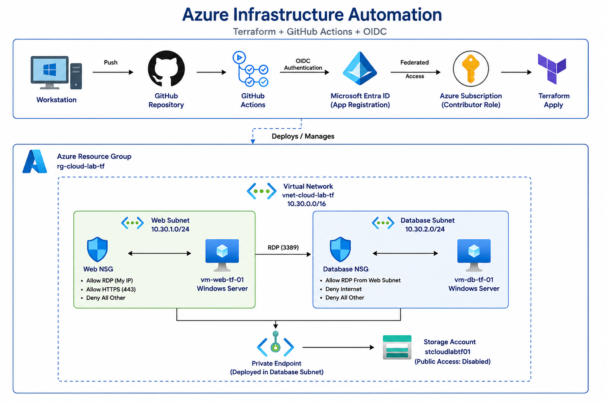

# Azure Infrastructure Automation Lab

## Overview

This project demonstrates how a manually deployed Azure environment can be transformed into a fully automated Infrastructure as Code (IaC) deployment using Terraform, GitHub Actions, and Azure OpenID Connect (OIDC) authentication.

The objective was to simulate a secure multi-tier cloud environment, validate network segmentation, and implement a CI/CD pipeline capable of deploying Azure resources without storing long-lived credentials.

---

## Architecture

The environment consists of:

* Azure Virtual Network (VNet)
* Web Subnet
* Database Subnet
* Network Security Groups (NSGs)
* Windows Server Virtual Machines
* Azure Storage Account
* Private Endpoint
* Private DNS Integration
* Terraform Remote State Backend
* GitHub Actions CI/CD Pipeline
* Azure OIDC Authentication

### Network Design

* The Web subnet hosts a Windows Server VM with controlled inbound access.
* The Database subnet hosts a private Windows Server VM with no public exposure.
* Network Security Groups enforce subnet-level access controls.
* Azure Storage is accessed through a Private Endpoint, preventing direct public access.

---

## Technologies Used

### Azure

* Azure Virtual Networks
* Network Security Groups
* Windows Server Virtual Machines
* Azure Storage Accounts
* Private Endpoints
* Private DNS Zones
* Microsoft Entra ID

### Infrastructure as Code

* Terraform
* AzureRM Provider
* Remote State Backend

### DevOps

* GitHub
* GitHub Actions
* Azure OIDC Authentication
* CI/CD Automation

---

## Key Objectives

* Design a segmented Azure network using multiple subnets
* Secure resources using Network Security Groups
* Deploy Windows Server workloads
* Restrict storage access using Private Endpoints
* Validate connectivity between network tiers
* Recreate infrastructure using Terraform
* Store Terraform state remotely in Azure Storage
* Automate deployments using GitHub Actions
* Implement secretless authentication using Azure OIDC

---

## Validation Performed

* Verified subnet-to-subnet communication
* Validated NSG rule enforcement
* Confirmed restricted access to private resources
* Executed Terraform deployments successfully
* Verified GitHub Actions pipeline execution
* Confirmed Azure OIDC authentication flow

---

## Skills Demonstrated

* Azure Networking
* Cloud Security
* Infrastructure as Code
* Terraform
* CI/CD Pipelines
* Identity & Access Management
* Azure Storage
* Private Networking
* GitHub Actions
* Cloud Automation

---

## Business Value

This project demonstrates how cloud infrastructure can be deployed consistently, securely, and repeatedly through automation. By replacing manual deployment tasks with Infrastructure as Code and CI/CD pipelines, organizations can reduce configuration drift, improve deployment reliability, and accelerate cloud operations.

---

## Future Enhancements

* Azure Firewall
* Application Gateway
* Terraform Modules
* Multi-Environment Deployments (Dev/Test/Prod)
* Azure Monitor & Log Analytics
* Automated Security Scanning
* Cost Management Reporting

---

## Author

Steven Lucas

Cloud Infrastructure | Azure | Terraform | GitHub Actions | Automation
